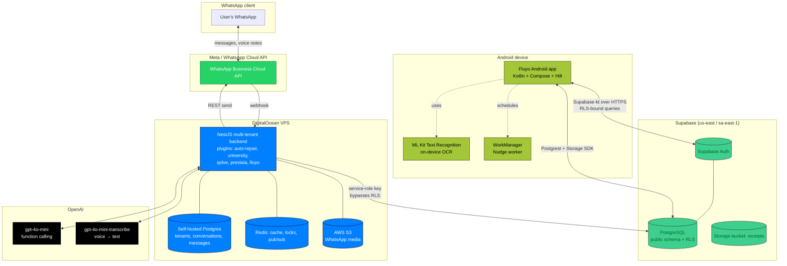
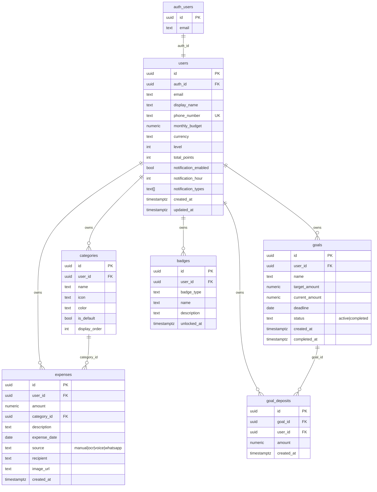
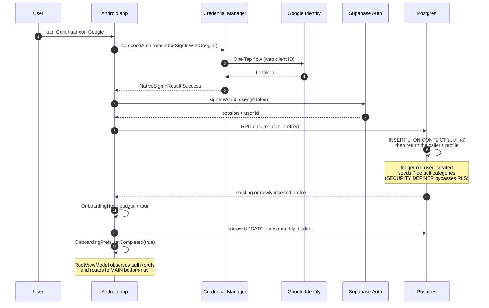
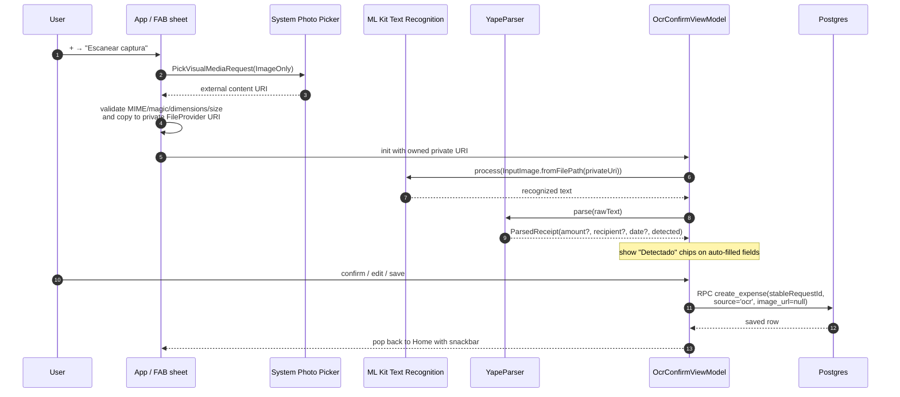
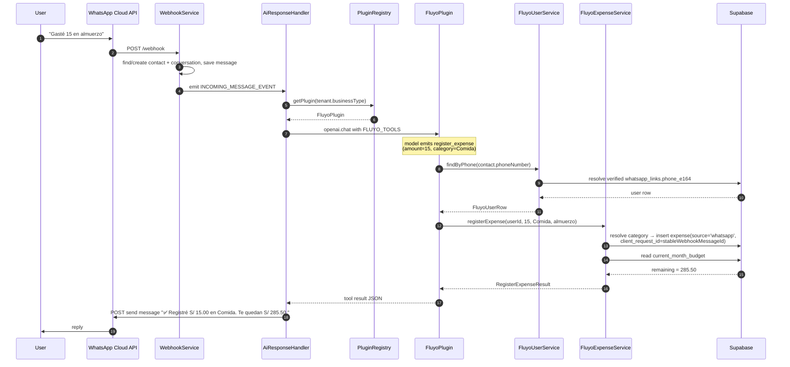
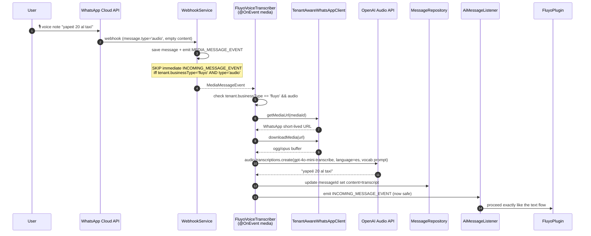
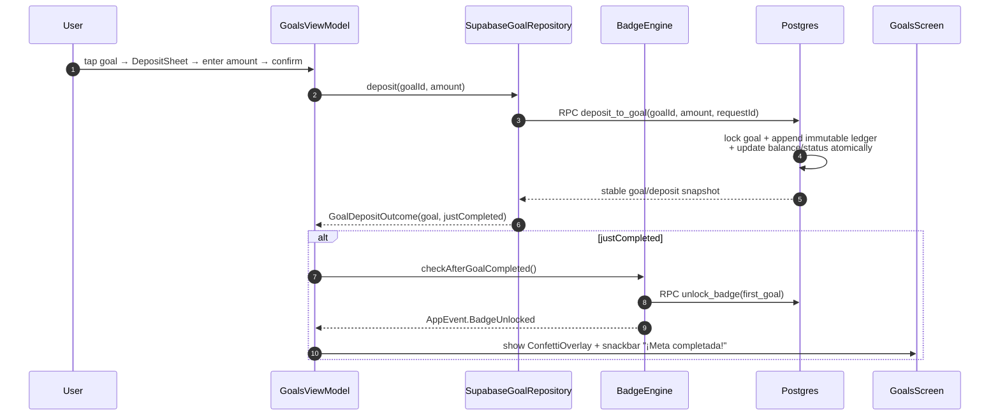
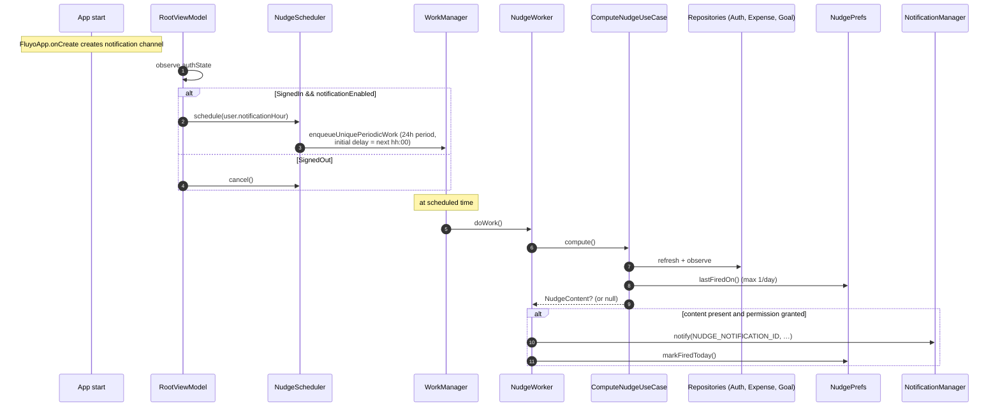

# Fluyo — System Design

**Status:** Audited against the Android app and SQL migrations in this repository (July 2026). External backend and deployed-cloud claims require verification in their own repositories/environments.
**Authors:** Jeremy Aldama (thesis, PUCP — Computer Science Engineering).
**Audience:** Thesis committee, future maintainers, anyone onboarding to the codebase.

This document is the source of truth for the components versioned here. CLAUDE.md contains contributor guidance. Descriptions of the external WhatsApp backend are integration context, not proof of its current deployment state.

---

## 1. Introduction

Fluyo is a personal-finance platform aimed at university students in Lima, Peru (ages 18–26) who use Yape/Plin daily and struggle to track expenses because manual registration is tedious. It exposes two surfaces over **the same Supabase Postgres database**:

1. **Android app** (Kotlin + Jetpack Compose) — primary interface. Tracks expenses via OCR of Yape/Plin screenshots, quick manual entry, and Android speech recognition. Includes gamification (badges, levels), savings goals, and local nudge notifications.
2. **WhatsApp bot** (external NestJS plugin) — secondary interface described by the integration design. Its source and deployment are not present in this checkout and must be audited separately.

The same user may use both surfaces. A trusted backend must prove control of the WhatsApp sender through the one-time challenge in migration `0006`; a phone typed into the profile is not sufficient proof.
The Android surface is hidden by default and only exists when `WHATSAPP_LINKING_ENABLED=true`
and a valid E.164 bot number are supplied at build time after that backend is verified.

### 1.1 Scope of this document

In scope: versioned components, data model, request flows, security model, integration/deployment context and known limitations.
Out of scope: thesis methodology (UCD process), user-research artifacts, marketing/copy decisions.

### 1.2 Goals (in priority order)

1. **OCR expense entry in ≤10 seconds.** Headline goal: scan Yape screenshot → confirm → saved.
2. **Manual expense entry in ≤5 seconds.** Amount → category → save.
3. **WhatsApp conversational entry** as fallback for when the app isn't open.
4. **Data minimization.** OCR runs on-device and its source image is not uploaded by the current Android flow. Legal compliance still depends on the policies and operations of the complete deployment.
5. **Habit reinforcement.** Daily nudge + streaks + badges + savings goals to keep users coming back.

### 1.3 Non-goals

- Currency conversion or per-expense multi-currency accounting. The current UI preference changes display formatting only.
- Bank-account linking / open banking integrations.
- Premium tier, ads, in-app purchases.
- Web client beyond the Supabase dashboard.

---

## 2. High-level architecture



### 2.1 Architectural decisions worth knowing

| Decision | Rationale |
|---|---|
| Supabase Postgres + RLS as primary store | Single source of truth across Android + WhatsApp surfaces. RLS lets the Android client connect directly with the user's JWT, no app-server-in-the-middle for CRUD. |
| Two databases (Supabase + self-hosted PG) | The WhatsApp backend pre-dates Fluyo and serves four other tenants (Tecnigas, MIT/PUCP, Qolve, PrestaIA) on its own Postgres. We didn't migrate them. Fluyo plugin opens a second connection to Supabase via `@supabase/supabase-js` using the service-role key. |
| OCR on-device, not server-side | Privacy + latency + cost. ML Kit Latin Text Recognition v2 is free, runs offline, never leaves the phone. |
| `gpt-4o-mini-transcribe` over `whisper-1` | Same OpenAI account/key, half the per-minute cost (~$0.003 vs $0.006), Spanish quality is more than adequate for short expense phrases. |
| Local nudges via WorkManager, not FCM | Thesis-scale; no need for server-triggered pushes. Avoids Firebase setup + per-device tokens + server-side push channel. Trade-off: notifications can't be triggered from the WhatsApp bot. |
| Clean Architecture + Hilt + StateFlow | Industry-standard for testable production Android. Domain layer has zero Android imports. |

---

## 3. Component breakdown

### 3.1 Android client — `app/`

The single Android application module follows Clean Architecture in 3 layers:

```
com.qolve.fluyo/
├── FluyoApp.kt                  # @HiltAndroidApp + Configuration.Provider for HiltWorkerFactory
├── MainActivity.kt              # @AndroidEntryPoint, hosts FluyoNavHost
│
├── domain/                      # PURE KOTLIN — no Android imports
│   ├── model/                   # Expense, Category, Goal, Badge, User, NudgeType, …
│   ├── repository/              # Interfaces only
│   └── usecase/                 # RegisterExpenseUseCase, ComputeNudgeUseCase, …
│
├── data/                        # Implementations + DTOs
│   ├── dto/                     # @Serializable, snake_case @SerialName
│   ├── mapper/                  # DTO ↔ domain
│   ├── repository/              # Supabase{Auth,Expense,Category,Goal,Badge}Repository
│   ├── ocr/                     # OcrService (ML Kit), YapeParser (regex parsing)
│   ├── badge/                   # BadgeEngine — checks streaks, completions
│   └── local/                   # OnboardingPrefs, NudgePrefs (DataStore)
│
├── notifications/               # WorkManager + channel + scheduler
├── di/                          # Hilt modules
└── presentation/
    ├── theme/                   # Material 3, brand palette, dynamic color disabled
    ├── navigation/              # NavHost, BottomNavBar, RootViewModel
    ├── events/                  # AppEvents bus (snackbars, badge unlocks)
    ├── util/                    # CategoryIcons, Money, BadgeUi
    ├── components/              # Cross-screen Compose primitives
    └── screens/                 # auth, onboarding, home, expense, scan, stats, goals, profile
```

#### 3.1.1 Tech stack

| Component | Choice | Version |
|---|---|---|
| Language | Kotlin | 2.2.10 |
| Build | Gradle wrapper / AGP, Kotlin DSL | 9.4.1 / 9.2.1 |
| Min SDK / Target / Compile SDK | 24 / 36 / 36.1 | Android 7 → Android 16 QPR2 |
| UI | Jetpack Compose + Material 3 | BOM 2026.02.01 |
| Architecture | Clean + MVVM | n/a |
| DI | Hilt + KSP | 2.59.2 / 2.2.10-2.0.2 |
| Async | Coroutines + StateFlow | 1.9.0 |
| Backend client | supabase-kt (Auth, Postgrest, Storage, ComposeAuth) | 3.0.2 |
| HTTP transport | Ktor OkHttp | 3.0.1 |
| Auth UX | Credential Manager + Google ID | 1.3.0 / 1.1.1 |
| OCR | ML Kit Text Recognition v2 | 16.0.1 |
| Background | WorkManager + Hilt-Work | 2.10.0 / 1.2.0 |
| Date/Time on API 24 | core library desugaring | 2.1.4 |
| Image loading | Coil | 2.7.0 |
| Local prefs | DataStore Preferences | 1.1.1 |

No chart library (Vico/MPAndroidChart). All charts — budget circle, donut, confetti — are custom `Canvas` composables. Keeps the dep surface minimal and the APK small.

#### 3.1.2 Theming

Custom `lightColorScheme` / `darkColorScheme` follow system. **Dynamic color (Material You) is explicitly disabled** for brand consistency. Palette anchors: `FluyoTeal #00897B`, `FluyoTealLight #4DB6AC`, `FluyoCoral #FF7043`, `FluyoCyan #26C6DA`.

### 3.2 Supabase platform

The project reference, region and environment credentials are deployment-specific and are intentionally not recorded in this repository. Development, staging and production must use separate projects and secrets.

Services in use:
- **Auth** — Google and email/password, including email-confirmation callbacks. The Web OAuth client ID is shared with the Android Credential Manager flow.
- **Postgres** — all app data. `public.users` is linked to `auth.users` via `auth_id`. RLS is enabled on every user-owned table and exercised by the migration test harness.
- **Storage** — migration `0007` versions a private, size/MIME-limited `receipts` bucket with owner-prefix policies and tombstone-aware write denial. The Android OCR flow neither uploads receipts nor persists its device-local URI.
- **Postgres triggers** — `seed_default_categories()` auto-seeds 7 categories on each `users` insert via `SECURITY DEFINER` so it bypasses RLS during the trigger.

Migrations live in `supabase/migrations/`:
- `0001_initial_schema.sql` — all tables + views + the seed trigger
- `0002_rls_policies.sql` — RLS policies (one per table, separate SELECT/INSERT/UPDATE for `users`; FOR ALL for the others)
- `0003_security_hardening.sql` — flips views to `security_invoker`, pins trigger function `search_path`, revokes RPC access to the seed trigger
- `0004_category_ondelete_setnull.sql` — changes the category foreign key to `ON DELETE SET NULL`
- `0005_budget_extras.sql` — adds extra income plus the current-month budget view/functions
- `0006_data_integrity_and_secure_operations.sql` — adds ownership/range constraints, atomic goal deposits, server-enforced gamification, Lima month semantics and verified WhatsApp-link primitives
- `0007_repository_closure.sql` — adds race-safe profile provisioning, idempotent financial-create RPCs, logical goal deletion, versioned private Storage, complete badge/summary behavior and challenge retention
- `supabase/contract-migrations/0008_write_path_contract.sql` — separately gated contract applied only after legacy clients are retired and historical state is repaired; revokes direct inserts for profiles/expenses/goals/extras/badges/deposits, removes direct goal mutation, narrows expense/profile updates and records file SHA-256 plus verified postconditions in a dedicated private registry. Intentional deletes of expenses/extras remain available under RLS.

The authenticated `delete-account` Edge Function lives under `supabase/functions/`. SQL behavior and RLS contracts run against PostgreSQL 17 in CI; the Edge Function is type-checked with Deno.

### 3.3 External WhatsApp backend

The backend source is **not contained in this repository**. The following section records the expected integration contract and previously supplied deployment context; it must not be treated as independently verified by the Android build or CI.

Stack: NestJS 11 + TypeORM 0.3 + self-hosted Postgres 16 + Redis (ioredis) + AWS S3 + OpenAI 6.x. Deployed on DigitalOcean VPS, containerized (Docker + nginx TLS).

#### 3.3.1 Plugin architecture

Each tenant has a `BusinessPlugin` implementation that exposes:
- `getTools()` — OpenAI function-calling tool schemas
- `getSystemPrompt()` — system instructions for that tenant's bot persona
- `executeToolCall(name, args, ctx)` — handles function invocations from the model

A tenant's `businessType` field (e.g., `'fluyo'`) is the registry key. When a webhook lands, `TenantContextInterceptor` resolves the tenant by `phone_number_id`, and `PluginRegistry` dispatches to the matching plugin.

#### 3.3.2 Fluyo plugin layout — `src/plugins/fluyo/`

9 TypeScript files:

```
src/plugins/fluyo/
├── fluyo.module.ts                          # Provides + exports all Fluyo services
├── fluyo.plugin.ts                          # implements BusinessPlugin
├── tools.ts                                 # OpenAI tool schemas + Spanish system prompt
├── index.ts
└── services/
    ├── fluyo-supabase.service.ts            # @supabase/supabase-js client (service-role key)
    ├── fluyo-user.service.ts                # verified E.164 → whatsapp_links → users.id
    ├── fluyo-expense.service.ts             # register_expense, get_monthly_summary, get_active_goals
    ├── fluyo-voice-transcription.service.ts # OpenAI Audio API wrapper, model: gpt-4o-mini-transcribe
    └── fluyo-voice-transcriber.service.ts   # OnEvent listener for incoming audio
```

The plugin exposes 4 OpenAI tools:
- `register_expense(amount, category, description?)`
- `get_monthly_summary()`
- `get_active_goals()`
- `handoff_to_human(reason)`

`category` is constrained to an `enum` of the 7 default categories; unknown values are resolved against the user's `categories` table case-insensitively, with `Otros` as fallback.

---

## 4. Data model

All tables live in Supabase Postgres, schema `public`. RLS enabled on every user-owned table.



**Notable constraints:**
- `users.phone_number` is legacy/profile input and is not proof of ownership. Migration `0006` adds `whatsapp_link_challenges` plus the backend-owned `whatsapp_links.phone_e164` mapping used for a verified WhatsApp identity.
- `expenses.source CHECK ('manual','ocr','voice','whatsapp')` — every expense carries its provenance.
- `badges UNIQUE(user_id, badge_type)` — server-side idempotency for the unlock engine.
- No `date_trunc(...)` indexes — Postgres rejects them as non-IMMUTABLE on a `date` column. The composite `(user_id, expense_date DESC)` index covers month-range queries fine.

**Views:**
- `current_month_budget(user_id, monthly_budget, total_spent, remaining, extra_income)` — used by Android Home and the WhatsApp `get_monthly_summary` tool. Computed live, `security_invoker = on` so RLS applies. Persisted movements remain `numeric(10,2)` (maximum `99,999,999.99` each), while these four aggregate/derived money columns use unconstrained PostgreSQL `numeric`; otherwise two individually valid maximum rows can overflow the view. Names, order and JSON-number transport remain compatible with the existing Android DTO.
- `monthly_category_summary` — used by Stats; same security stance.

---

## 5. Key flows

### 5.1 First-time sign-in + onboarding



### 5.2 OCR expense flow (target ≤10 seconds)



The parser is regex-based (`S/\s*\.?\s*(\d{1,3}(?:[.,]\d{3})*(?:[.,]\d{1,2})?)`) and recognizes Yape's "Yapeaste a / Le enviaste a / Pagaste a" recipient cues plus numeric and Spanish-month date formats. It is intentionally conservative: leaves fields null rather than guessing wrong, because the confirm screen lets the user fix anything.

### 5.3 WhatsApp text expense



Phone resolution canonicalizes the authenticated webhook sender once to E.164 and
requires an exact active `whatsapp_links.phone_e164` match. Free-form onboarding phone
values and country-code guessing are not identity evidence.

### 5.4 WhatsApp voice note expense (Phase 4.2)

This is non-obvious because of the audio-gating dance.



Why the gate? `AiMessageListener` would otherwise pick up the immediate `INCOMING_MESSAGE_EVENT` with empty content, generate a "How can I help?"-flavored response, AND THEN the transcriber would fire a *second* response. The gate makes Fluyo audio messages single-pass. Other tenants are unaffected — they don't have audio transcription and process messages as before.

### 5.5 Goal deposit + completion



### 5.6 Nudge scheduling (Phase 6)



**Priority order** when picking what to nudge about (first match wins):

1. **Budget** — `percentageUsed >= 80%`
2. **Goal** — any active goal at `>= 70%` progress
3. **Reminder** — no expense in `>= 2 days`
4. **Progress** — current streak `>= 3 days`

All four are user-toggleable in Profile → Notificaciones.

---

## 6. Security model

### 6.1 Authentication

- **Android:** Supabase Auth via Credential Manager One Tap. Token is stored in supabase-kt's session manager (encrypted by Android KeyStore-backed prefs).
- **Backend:** the existing platform has its own JWT auth for admin endpoints (unrelated to Fluyo end users). The Fluyo plugin authenticates *to Supabase* as the service role. End users do not present a Supabase JWT to WhatsApp; the trusted webhook must resolve the normalized sender against a verified `whatsapp_links` row.

### 6.2 Authorization — Row Level Security

Every user-owned table has RLS enabled. Policies on disk in `supabase/migrations/0002_rls_policies.sql`:

```sql
create policy users_select_own on public.users
  for select using (auth.uid() = auth_id);

create policy expenses_rw_own on public.expenses for all
  using (user_id in (select id from public.users where auth_id = auth.uid()))
  with check (user_id in (select id from public.users where auth_id = auth.uid()));
-- (same pattern for categories, goals, badges, goal_deposits)
```

The Android app connects with the **anon key + the user's JWT**, so RLS enforces tenancy. Two users can never see each other's data via the Android client.

### 6.3 Backend service-role exception

The Fluyo NestJS plugin uses the **service-role key**, which bypasses RLS. This is necessary because:
- The bot has no way to obtain the user's Supabase JWT (the user is a WhatsApp identity, not a Supabase session).
- The bot must write expenses on behalf of users whose one-time challenge was confirmed from the authentic WhatsApp sender.

**Mitigations:**
- The service-role key is read from `FLUYO_SUPABASE_SERVICE_ROLE_KEY` env var only on the VPS; never committed (`.env.example` ships only placeholder).
- The plugin enforces "tenant must be Fluyo" before doing anything: a different tenant's webhook cannot route to Fluyo's tools.
- The plugin resolves users by their *own* WhatsApp number; it never accepts a target user ID from the model.
- If the normalized sender has no matching verified `whatsapp_links.phone_e164`, the plugin must refuse the write and guide the user through the challenge flow.
- Every privileged financial insert includes a stable, non-null `client_request_id`
  derived from the immutable webhook message ID. `service_role` bypasses RLS, not the
  constraints in contract `0008`; retries must find/return the existing movement.

### 6.4 OCR and on-device data

ML Kit Text Recognition runs entirely on-device. The Android flow saves only the confirmed structured expense, always sends `image_url = null`, removes owned captures after use and scrubs shared URIs from the Activity intent. Receipt copies are not uploaded by this application.

### 6.5 Voice transcription path

The intended external path for WhatsApp voice notes is: phone → WhatsApp Cloud API (Meta) → external backend → transcription provider → transcript text → Supabase. That backend is outside this repository, so its actual retention, deletion and storage behavior is not asserted here and must be audited independently. In-app voice uses the installed Android speech-recognition provider and shows a disclosure before launch.

### 6.6 Compliance — Ley N° 29733 (PE)

Personal-data points collected by this app are email, display name, financial records and—only after a one-time sender challenge—the verified WhatsApp E.164 identity. Free-form phone entry was removed. Sign-out clears session-scoped state; self-service deletion calls the authenticated `delete-account` Edge Function and purges account-scoped local preferences. Production compliance still depends on deploying that function and an external cleanup endpoint that blocks new writes before draining media.

---

## 7. Non-functional concerns

### 7.1 Performance budget

| Path | Target | Current |
|---|---|---|
| Manual expense save | ≤ 5 s | ~1–2 s (single Postgrest insert) |
| OCR scan → confirm | ≤ 10 s | ~3–6 s on Pixel-class device |
| WhatsApp text → reply | ≤ 5 s | ~3–8 s (one OpenAI call) |
| WhatsApp voice → reply | ≤ 15 s | ~5–12 s (download + transcribe + OpenAI call) |
| Nudge worker run | n/a (background) | < 1 s |

### 7.2 Cost model (thesis-scale: ~1k users, ~100 voice notes/user/month)

| Service | Driver | Monthly estimate |
|---|---|---|
| Supabase | Free tier (500 MB DB, 1 GB storage) | $0 |
| DigitalOcean VPS | Existing — shared with 4 other tenants | absorbed |
| OpenAI gpt-4o-mini (chat) | ~3 turns/expense × 100 expenses × 1k users | ~$30 |
| OpenAI gpt-4o-mini-transcribe | 100 voice × 15s × 1k users = 25k min | ~$75 |
| WhatsApp Cloud API | Conversations on Meta's pricing (mostly free user-initiated) | ~$10–30 |
| ML Kit | Free, on-device | $0 |
| **Total** | | **~$120–135/mo** |

Self-hosting Whisper.cpp on the VPS would zero the $75 line at the cost of latency and DevOps. Worth revisiting post-thesis.

### 7.3 Scaling limits we'd hit first

- Supabase free tier: 500 MB DB / 50k MAU. ~50k users × ~365 days × ~5 expenses/day at ~200 bytes = ~18 GB. Would migrate to Pro ($25/mo) around year 1 at 5k users.
- DO VPS: existing tenants are the constraint, not Fluyo. CPU/RAM headroom is comfortable for the chatbot loop.
- OpenAI: rate limits are well below typical thesis-scale usage.

---

## 8. Deployment topology

| Component | Where it runs | How it's deployed |
|---|---|---|
| Android APK/AAB | User device / Play | Debug is signed with the debug key and leaves legal URLs empty. Distribution tasks fail closed unless signing credentials and real HTTPS terms/privacy/account-deletion URLs are supplied; `bundleReleaseUnsigned` is an explicit local-inspection variant and must not be published. Play App Signing setup remains external. |
| Supabase project | Environment-specific Supabase cloud project | Reviewed `supabase db push` for `0001..0007`; apply contract `0008` with the confirmed registry script only after its rollout gate. Deploy/type-check `delete-account` separately and record each environment change. |
| NestJS backend | DigitalOcean droplet | Docker compose + nginx (TLS via Let's Encrypt). Re-deploy via `deploy.sh`. Shared with 4 other tenants. |
| WhatsApp Cloud API | Meta-hosted | Webhook configured in Meta Business Manager pointing at `https://<vps>/webhook`. Tenant resolution by `phone_number_id`. |
| OpenAI | OpenAI cloud | API calls only, no infra. |

---

## 9. Known limitations & future work

| # | Limitation | Severity | Path forward |
|---|---|---|---|
| L1 | In-app voice uses the device's `RecognizerIntent`; availability, network processing and transcription behavior depend on the installed speech-recognition provider. The app discloses this boundary and handles an unavailable recognizer, but device coverage remains external. | medium (privacy/UX) | Validate behavior and wording across supported recognizers/devices. |
| L2 | Self-service deletion code exists, but production deployment, external write tombstoning/media cleanup and public deletion/legal URLs are not verifiable from this repository. | high (compliance/operations) | Deploy and exercise the full failure/success contract in staging, then production. |
| L3 | Nudges are local-only; the bot cannot trigger them. | low | Add an FCM token table + Edge Function if needed. Defer until usage data justifies it. |
| L4 | Receipt images are intentionally not retained, so the product has no historical receipt preview. | low (product trade-off) | Add an explicit consent, retention and RLS design before introducing uploads. |
| L5 | Database invariants and RLS have an automated PostgreSQL 17 contract harness, but they must also be validated against each hosted environment after rollout. | low (operations) | Run the smoke checklist against staging and record migration versions. |
| L6 | RLS prevents the same user accessing data across Android sessions on multiple devices simultaneously? No — RLS is per-JWT, multi-device works fine. *(Not actually a limitation, noted to forestall confusion.)* | n/a | n/a |
| L7 | Release tasks now require complete signing credentials, but the upload keystore and Play metadata still have to be provisioned outside Git. | blocker for launch | Set up Play App Signing, protect CI secrets, register release SHA-1 and prepare the store listing. |
| L8 | CI executes focused security/import instrumentation tests on an API 35 emulator, but it still lacks complete end-to-end Compose journeys and a physical-device matrix. | medium (test depth) | Add critical user journeys and device/API coverage in managed devices or Test Lab. |
| L9 | No analytics or crash reporting wired up. | medium | Crashlytics or Sentry post-Play. |
| L10 | The "important-while-foreground" job-info warning (Android 14+) is benign WorkManager noise; the work still runs. | none | Ignore. |
| L11 | The WhatsApp/NestJS implementation and infrastructure are outside this repository, so its service-role handling, phone binding and media retention cannot be verified here. | high (assurance) | Link an immutable backend revision or include it as a separately audited project. |
| L12 | `FLAG_SECURE` protects financial/authentication screens and Recents previews, so normal user screenshots and screen recordings are intentionally unavailable. | product trade-off | Reassess only with an explicit privacy/product decision; debug through logs/tests rather than real-data captures. |
| L13 | Email confirmation still returns through a custom `fluyo://` scheme, which another Android app could claim. Callback URIs are strictly validated, scrubbed and never logged, but origin ownership cannot be proven without a domain. | medium (auth hardening) | Provision an HTTPS domain, publish `assetlinks.json`, register a verified App Link and update the exact Supabase redirect allow-list. |

---

## 10. Glossary

| Term | Meaning |
|---|---|
| RLS | Row Level Security — Postgres-level access control bound to the requester's JWT claims. |
| Service-role key | Supabase admin key that bypasses RLS. Used only by the Fluyo backend plugin. |
| Tenant | A customer of the WhatsApp platform; identified by `businessType`. Fluyo is one of five tenants. |
| ComposeAuth | supabase-kt module that wraps Credential Manager / OAuth flows in a Compose-friendly API. |
| Postgrest | Supabase's auto-generated REST API over Postgres. supabase-kt's `postgrest` client calls it. |
| ML Kit | Google's on-device ML library. We use its Latin Text Recognition v2 model. |
| Yape / Plin | Two dominant peer-to-peer payment apps in Peru; their transaction screenshots are what Fluyo's OCR is tuned for. |
| Nudge | A daily on-device push notification computed by `ComputeNudgeUseCase` and fired by `NudgeWorker`. |
| Streak | Number of consecutive calendar days where the user registered at least one expense. |

---

## 11. Document maintenance

Update this document when any of the following change:
- A new external dependency (Supabase project, OpenAI endpoint, DO host) is introduced
- A new top-level Android module/package or backend plugin
- Any RLS policy or service-role usage
- Any "what gets sent to which third party" answer
- Any cost-model assumption

Do **not** update it for routine refactors, new screens, or UI polish — those are visible in the code.
